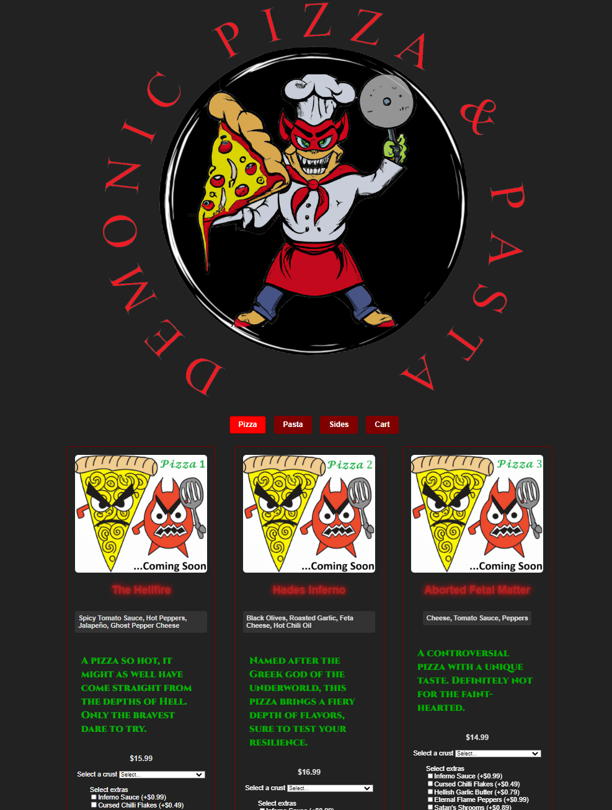

<h1>Demonic Pizza &amp; Pasta</h1>

Demonic Pizza &amp; Pasta is a full-stack restaurant ordering app where users can order their favorite pizza or pasta dishes right from their computers. Users can browse through a menu, customize their orders, add items to their cart, <del>and place their orders.</del>

This app provides functionalities such as:

<ul>
  <li>User Sign Up &amp; Login system</li>
  <li>User authentication using JSON Web Tokens</li>
  <li>An interactive shopping cart experience</li>
  <li>Delivery option for orders</li>
</ul>

<h2>Technologies</h2>

This application is built with a MERN stack. Here are some of the key technologies used:

<ul>
  <li>React.js</li>
  <li>Node.js</li>
  <li>Express.js</li>
  <li>MongoDB</li>
  <li>Apollo Client for state management</li>
  <li>GraphQL for APIs</li>
  <li>JSON Web Tokens for authentication</li>
</ul>

<h2>Getting Started</h2>

<h3>Prerequisites</h3>

<ul>
  <li>Node.js</li>
  <li>npm</li>
  <li>MongoDB</li>
</ul>

<h3>Installation</h3>

Clone the repository:

<pre>git clone https://github.com/your-github-username/demonic-pizza.git</pre>

Navigate into the project directory:

<pre>cd demonic-pizza</pre>

Install the dependencies for both the server and the client:

<pre>npm install</pre>

Seed the database:

<pre>npm run seed</pre>

Start the server:

<pre>npm run start</pre>

Then open a new terminal, navigate to the client directory, and start the client:

<pre>cd client npm run start</pre>

Now the client is running on localhost:3000 and the server is running on localhost:3001.

<h3>Scripts</h3>

Here are the available scripts:

<ul>
  <li><pre>npm start</pre>: Start the production server</li>
  <li><pre>npm run develop</pre>: Start the development server</li>
  <li><pre>npm run seed</pre>: Seed the database with initial data</li>
  <li><pre>npm run build</pre>: Build the app for production</li>
</ul>

<h2>Features</h2>

<h3>User Authentication</h3>

Users can sign up for a new account, and log in. User authentication is handled using JSON Web Tokens.

<h3>Shopping Cart</h3>

Users can add items to their shopping cart, view the cart, update quantities, and proceed to checkout.

<h3>Checkout</h3>

<del>Users can place their orders by providing their delivery address and payment details.</del>

<h2>Contributing</h2>

Contributions are welcome! Please read the contributing guidelines before getting started.

<h2>License</h2>

This project is licensed under the MIT License.

<h2>Contact</h2>

If you have any questions, please feel free to reach out.

